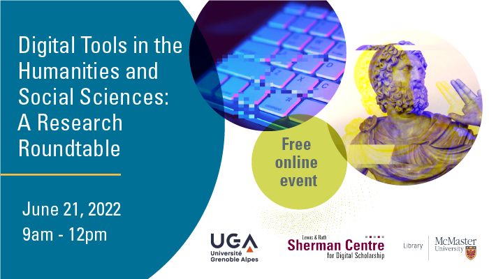

# Welcome to Digital Tools in the Humanities and Social Sciences: A Research Roundtable

How can digital tools enhance and complexify research in the humanities and social sciences? At this research roundtable, ten scholars from McMaster University and Universite Grenoble Alpes share their work in the Digital Humanities and Social Sciences.

These presentations engage with a wide variety of approaches, disciplines, and research methods. Learn about how digital platforms sharpen students' communication skills. Engage with the challenges of analyzing a massive digital database of e-petitions. See how GIS technology is reviving an ancient Greek city. Take a closer look at how NGOS represent women in online imagery. Explore how memes challenge academic posturing on Zoom. 

The roundtable is divided into three clusters: [Data](https://scds.github.io/dh-roundtable/data.html), [Social Media](https://scds.github.io/dh-roundtable/social-media.html), and [Teaching and Pedagogy](https://scds.github.io/dh-roundtable/Teaching.html). Each cluster includes a discussion period. 

Browse the complete [event schedule](https://scds.github.io/dh-roundtable/schedule.html). Watch each cluster by clicking the links above.  
